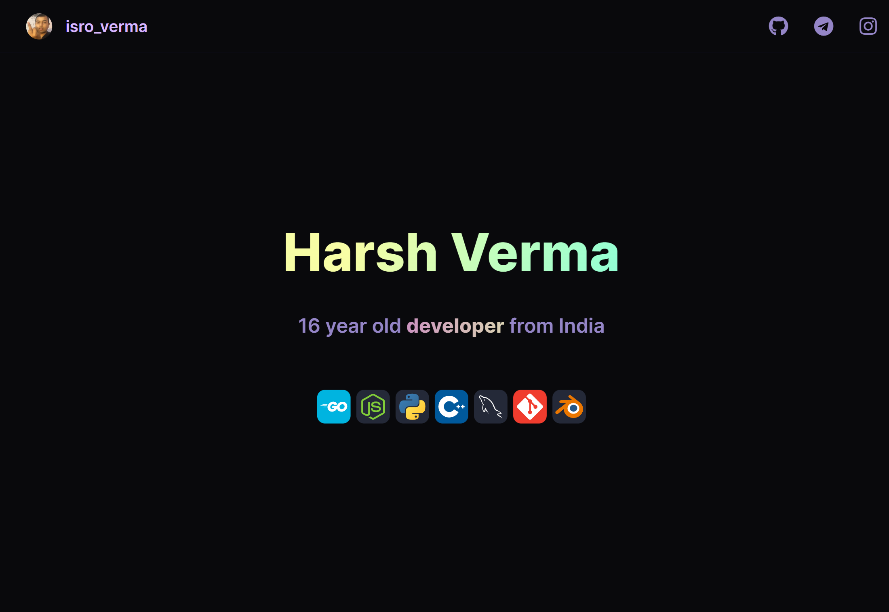

## 🏆 Features

- Responsive 
- Fully SEO Optimised 
- Light-weight
- Simple but Awsm!
- Dark Mode

##  🙈 Sneak Peek of Site :

&nbsp;&nbsp;<a href="https://isroharsh.github.io/">Watch live</a>

## 🧰 Support
- Email: <gamoaster@gmail.com>

## 📜 License
This code is provided under the MIT License. You are free to use, modify, and distribute it as needed. However, please keep in mind that this code is for educational purposes and should be used responsibly and in compliance with applicable laws.

  
  
  

